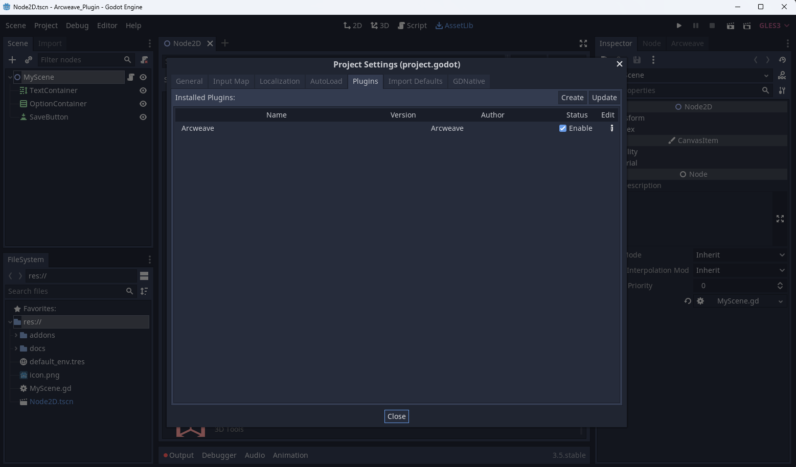
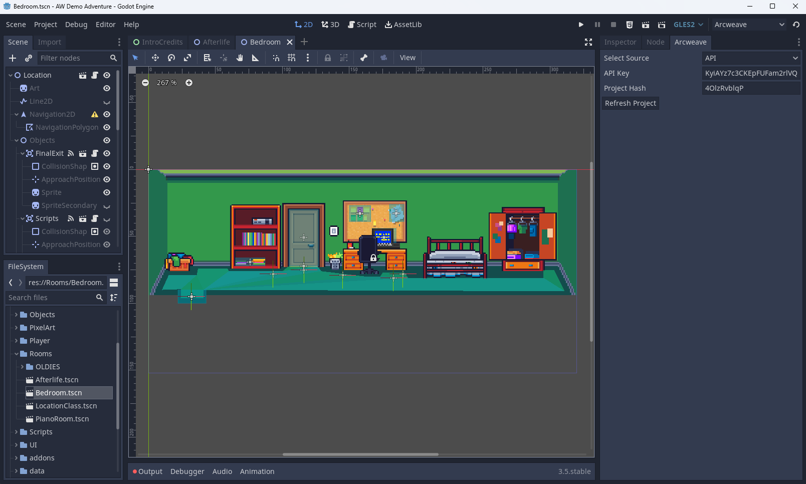

# Arcweave Godot Plugin

Arcweave Godot Plugin is a plugin for importing Arcweave Projects from [arcweave.com](https://arcweave.com/) in Godot and using them in your Projects.

The Arcweave Godot Exports currently are offered to our Pro and Team Accounts.

The exports consist from two `.gd` files, `data_export.gd` and `state_export.gd`. These contain the data from your project as well as helper functions in order to use [arcscript](https://arcweave.com/docs/1.0/arcscript), Arcweave's scripting language in your Godot Projects.

## Table of Contents

- [Arcweave Godot Plugin](#arcweave-godot-plugin)
  - [Table of Contents](#table-of-contents)
  - [Installing the Plugin](#installing-the-plugin)
  - [Importing your project](#importing-your-project)
    - [Folder Import](#folder-import)
    - [API Import](#api-import)
  - [Using the Plugin](#using-the-plugin)
  - [API Documentation](#api-documentation)
    - [Story](#story)
    - [Component](#component)
    - [Element](#element)
    - [Board](#board)

---

## Installing the Plugin

Download the plugin and add the `addons/arcweave` folder in your project's `addons` folder.

Then refresh your project, go to `AssetLib` -> `Plugins` and enable it.



Now the Godot Plugin should appear in the Right Dock of the Godot Engine

---

## Importing your project

You can import your project in two ways, using our API or by downloading the Godot Export, unzipping the contents and selecting the unzipped folder

### Folder Import

To use the Folder Import you will have to download the Godot Engine Export for your Arcweave Project.

In your Arcweave Project select the Export Option from the top right corner


Then Select the Engine Tab and Download the Export file for Godot.


Save the zip file in your computer and extract it. Two files should appear, `data_export.gd` and `state_export.gd`.

-----

From the Arcweave Plugin select the source to be **Folder Selection**.


Then Select the folder containing the extracted files and **Refresh From Folder**

### API Import

To use the API import functionality, you will have to be in a Team Plan in Arcweave.

Using the instructions in the [Arcweave Documentation](https://arcweave.com/docs/1.0/api) to create and use an API Token.

From the Arcweave Plugin select the source to be **API** and fill your **API Key** and your **Project Hash**. The **Project Hash**.



Then press **Refresh Project**

In the Godot Engine Output a **SUCCESS** message should appear.

[TOC](#table-of-contents)

---

## Using the Plugin

The main Class that the user should use is the [**Story**](#story) class of the plugin. This has most of the functionalities needed to traverse through a Project

Our plugin has some Classes to represent Arcweave's Nodes. These are:

* [**Element**](#element)
* [**Component**](#component)
* [**Board**](#board)

Also a **Util** Class exists with Utility Functions used to transpile Arcscript to Godot.

To start a Project's Story you have to initialize a Story instance.

```gdscript
var story: Story
func _ready():
    self.story = Story.new()
```

During the initialization, the data is loaded, the starting_element is set and the Element Options are generated.

If you have a text container you can use the `story.get_current_content()` function to get the text of the current element and set it.

```gdscript
var textContainer: RichTextLabel
var story: Story
func _ready():
    self.story = Story.new()

    textContainer.bbcode_enabled = true
    textContainer.bbcode_text = story.get_current_content()
```

You can also use `story.get_current_options()` function to get the options of the current element:

```gdscript
var textContainer: RichTextLabel
var optionContainer: VBoxContainer

var story: Story
func _ready():
    self.story = Story.new()

    textContainer.bbcode_enabled = true
    textContainer.bbcode_text = story.get_current_content()
    self.addOptions(story.get_current_options())

func addOptions(options):
    for n in self.optionContainer.get_children():
        self.optionContainer.remove_child(n)
        n.queue_free()

    ## The option.connectionPath has all the connections of the element.
    ## Since it might not have a label, we keep only the last available label or a separate default label.
    for option in options:
        var lastLabel = null
        for connection in option.connectionPath:
            if connection.label:
                lastLabel = connection.label
        if lastLabel == null:
            lastLabel = self.story.elements[option.targetid].title
        if lastLabel == null or lastLabel == "":
            lastLabel = self.story.elements[option.targetid].get_content(self.story.state)
        self.createButton(lastLabel, option)
```
[TOC](#table-of-contents)

---

## API Documentation


### Story

The story class provides the following functions

| Function Name                                   | Description                               |
| :---                                            | :---                                      |
| `get_current_element() -> Element`              | Returns the current Element               |
| `set_current_element(id: String)`               | Sets the current element                  |
| `get_current_content() -> String`               | Returns the current element's content     |
| `get_current_options() -> Array`                | Returns the current element's options     |
| `get_element(element_id: String) -> Element`    | Returns an element                        |
| `get_state() -> Dictionary`                     | Returns the current state of the project  |
| `set_state(state: Dictionary)`                  | Sets the current state of the project     |
| `select_option(option)`                         | Select's an option                        |

### Component

Variables

* `var id: String`
* `var name: String`
* `var cover: Dictionary`
* `var attributes: Dictionary`

Functions

| Function Name                                       | Description                                       |
| :---                                                | :---                                              |
| `get_name()`                                        | Returns the name of the Component                 |
| `get_attribute_by_name(name: String) -> Dictionary` | Returns the first attribute with this name        |
| `search_attributes_by_name(name: String) -> Array`  | Returns an array with attributes with this name   |
| `get_cover() -> Dictionary`                         | Returns the cover information for the component   |

### Element

Variables

* `var id: String`
* `var title: String`
* `var theme: String`
* `var outputs: Array`
* `var components: Array`
* `var attributes: Dictionary`
* `var cover: Dictionary`
* `var content_ref`

Functions

| Function Name                                       | Description                                           |
| :---                                                | :---                                                  |
| `get_content(state: Dictionary) -> String`          | Returns the content of the element based on the state |
| `get_cover() -> Dictionary`                         | Returns the cover information for the element         |

### Board

Variables 

* `var id: String`
* `var customId: String`
* `var name: String`
* `var elements: Dictionary`
* `var connections: Dictionary`
* `var notes: Dictionary`
* `var jumpers: Dictionary`
* `var branches: Dictionary`

[TOC](#table-of-contents)
