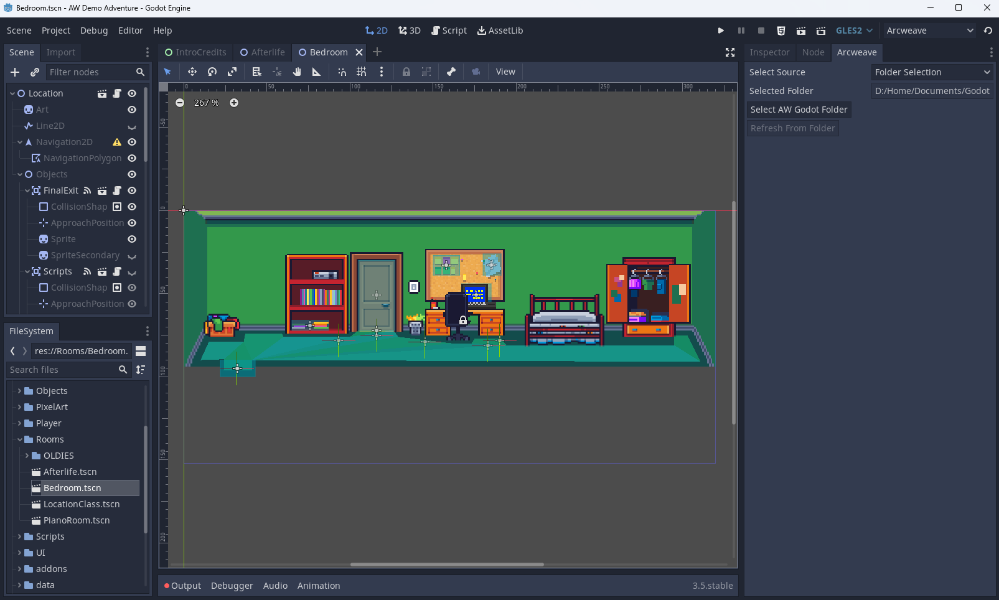

# Arcweave Godot Plugin

Arcweave Godot Plugin is a plugin for importing Arcweave Projects from [arcweave.com](https://arcweave.com/) in Godot and using them in your Projects.

The Arcweave Godot Exports currently are offered to our Pro and Team Accounts.

The exports consist from two `.gd` files, `data_export.gd` and `state_export.gd`. These contain the data from your project as well as helper functions in order to use [arcscript](https://arcweave.com/docs/1.0/arcscript), Arcweave's scripting language in your Godot Projects.

## Table of Contents

- [Arcweave Godot Plugin](#arcweave-godot-plugin)
  - [Installing the Plugin](#installing-the-plugin)
  - [Getting data from Arcweave](#getting-data-from-arcweave)
    - [Folder Import](#folder-import)
    - [API Import](#api-import)
  - [Creating an ArcweaveResource](#creating-an-arcweaveresource)
    - [Loading the Project Data](#loading-the-project-data)
    - [Using the ArcweaveResource](#using-the-arcweaveresource)
      - [Use ArcweaveNode](#use-arcweavenode)
      - [Create your own Node](#create-your-own-node)
  - [Our Implementation](#our-implementation)
  - [Using the Plugin](#using-the-plugin)
  - [API Documentation](#api-documentation)
    - [Story](#story)
    - [Component](#component)
    - [Element](#element)
    - [Board](#board)

---

## Installing the Plugin

Download the plugin and add the `addons/arcweave` folder in your project's `addons` folder.

Then refresh your project, go to `Project` -> `Project Settings` -> `Plugins` and enable it.

## Getting data from Arcweave

You can import your project in two ways, using our API or by downloading the Godot Export and selecting the exported file

### Folder Import

To use the Folder Import you will have to download the Godot Engine Export for your Arcweave Project.

In your Arcweave Project select the Export Option from the top right corner


Then Select the Engine Tab and Download the Export file for Godot.


Save the zip file in your computer and extract it. Two files should appear, `data_export.gd` and `state_export.gd`.

-----

From the Arcweave Plugin select the source to be **Folder Selection**.



Then Select the folder containing the extracted files and **Refresh From Folder**

### API Import

Feature available to Team account holders only. You can fetch your Arcweave project's data from within Godot, via Arcweave's web API.

To do this, you will need:

* your **API key** as an Arcweave user.
* your **project's hash**.

[This chapter](https://arcweave.com/docs/1.0/api) in the Arcweave Documentation explains where to find both of them.

## Creating an ArcweaveResource

Either way, to import your data into Godot, you must create an **ArcweaveResource** in your Godot project. To do this, right-click on your Godot FileSystem tab, select **New Resource** and find the **ArcweaveResource** option and pick the file name of your choice. 

### Loading the Project Data

Open the newly created resource's inspector. You will see two options for selecting either a file or use the Arcweave API to retrieve the data.

- **Importing from JSON**: Click on **Select Project File**, find your downloaded export file and select it.
- **Importing from API**: Fill the **API key** and **Project Hash** values.

Then click on **Initialize Arcweave Asset** button. This will either load the project from the file, or fetch the data from the API and store it's info in the Resource.

### Using the ArcweaveResource

#### Use ArcweaveNode

You can create your own nodes and use them to interract with the resource, but we are also providing a new Node Type, **ArcweaveNode** that you can use. 

Add an **ArcweaveNode** as a child node in your scene and use the Inspector tab connect it to your resource that you created earlier.

#### Create your own Node

You can also create your own nodes and interract with the ArcweaveResource. 

In order to update during runtime though, you would have to add the node `APIRequest.gd` inside your scene. This will insert an HTTPRequest node in your scene and you will be able to make requests

## Our Implementation

Most of our implementation, except ArcweaveResource and some editor GDScript classes, are written in C#. This means that not all of the API is available in GDScript, because of type compatibility issues. The reason is that the interpreter we are using is written in C# with built in types. 

Using functions with the name pattern `GetGodot*` will retreive the appropriate instance properties in Godot types but doing this will require copying and typecasting, so the experience might be slower.

We are planning to integrate Godot types in our interpreter in the near future that will speed up this process.

## Using the Plugin

The main Class that the user should use is the [**Story**](#story) class of the plugin. This has most of the functionalities needed to traverse through a Project

Our plugin has some Classes to represent Arcweave's Nodes. These are:

* [**Element**](#element)
* [**Component**](#component)
* [**Board**](#board)

Also a **Util** Class exists with Utility Functions used to transpile Arcscript to Godot.

To start a Project's Story you have to initialize a Story instance.

```gdscript
var story: Story
func _ready():
    self.story = Story.new()
```

During the initialization, the data is loaded, the starting_element is set and the Element Options are generated.

If you have a text container you can use the `story.get_current_content()` function to get the text of the current element and set it.

```gdscript
var textContainer: RichTextLabel
var story: Story
func _ready():
    self.story = Story.new()

    textContainer.bbcode_enabled = true
    textContainer.bbcode_text = story.get_current_content()
```

You can also use `story.get_current_options()` function to get the options of the current element:

```gdscript
var textContainer: RichTextLabel
var optionContainer: VBoxContainer

var story: Story
func _ready():
    self.story = Story.new()

    textContainer.bbcode_enabled = true
    textContainer.bbcode_text = story.get_current_content()
    self.addOptions(story.get_current_options())

func addOptions(options):
    for n in self.optionContainer.get_children():
        self.optionContainer.remove_child(n)
        n.queue_free()

    ## The option.connectionPath has all the connections of the element.
    ## Since it might not have a label, we keep only the last available label or a separate default label.
    for option in options:
        var lastLabel = null
        for connection in option.connectionPath:
            if connection.label:
                lastLabel = connection.label
        if lastLabel == null:
            lastLabel = self.story.elements[option.targetid].title
        if lastLabel == null or lastLabel == "":
            lastLabel = self.story.elements[option.targetid].get_content(self.story.state)
        self.createButton(lastLabel, option)
```

## API Documentation


### Story

The story class provides the following functions

| Function Name                                   | Description                               |
| :---                                            | :---                                      |
| `get_current_element() -> Element`              | Returns the current Element               |
| `set_current_element(id: String)`               | Sets the current element                  |
| `get_current_content() -> String`               | Returns the current element's content     |
| `get_current_options() -> Array`                | Returns the current element's options     |
| `get_element(element_id: String) -> Element`    | Returns an element                        |
| `get_state() -> Dictionary`                     | Returns the current state of the project  |
| `set_state(state: Dictionary)`                  | Sets the current state of the project     |
| `select_option(option)`                         | Select's an option                        |

### Component

Variables

* `var id: String`
* `var name: String`
* `var cover: Dictionary`
* `var attributes: Dictionary`

Functions

| Function Name                                       | Description                                       |
| :---                                                | :---                                              |
| `get_name()`                                        | Returns the name of the Component                 |
| `get_attribute_by_name(name: String) -> Dictionary` | Returns the first attribute with this name        |
| `search_attributes_by_name(name: String) -> Array`  | Returns an array with attributes with this name   |
| `get_cover() -> Dictionary`                         | Returns the cover information for the component   |

### Element

Variables

* `var id: String`
* `var title: String`
* `var theme: String`
* `var outputs: Array`
* `var components: Array`
* `var attributes: Dictionary`
* `var cover: Dictionary`
* `var content_ref`

Functions

| Function Name                                       | Description                                           |
| :---                                                | :---                                                  |
| `get_content(state: Dictionary) -> String`          | Returns the content of the element based on the state |
| `get_cover() -> Dictionary`                         | Returns the cover information for the element         |

### Board

Variables 

* `var id: String`
* `var customId: String`
* `var name: String`
* `var elements: Dictionary`
* `var connections: Dictionary`
* `var notes: Dictionary`
* `var jumpers: Dictionary`
* `var branches: Dictionary`
