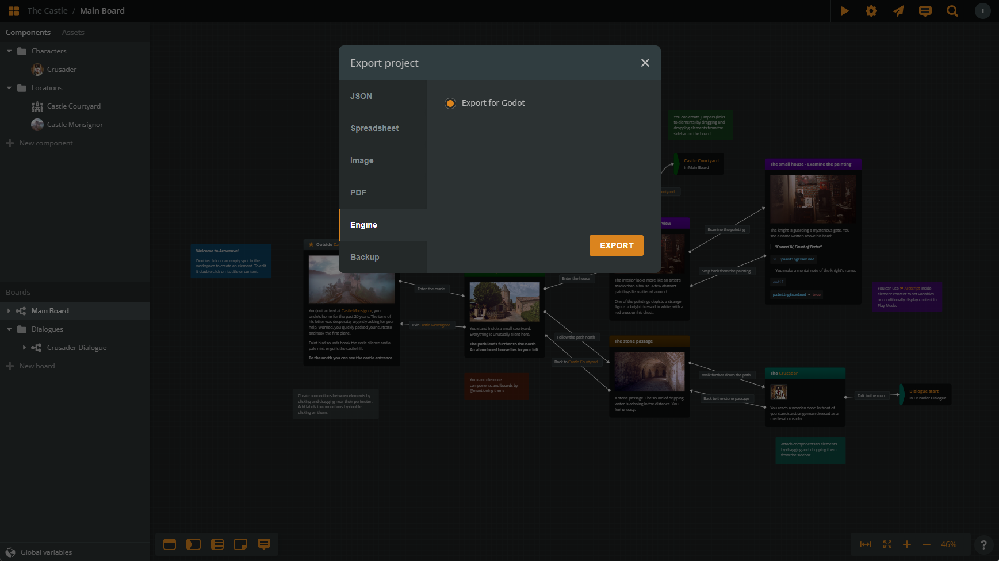

# Arcweave Godot Plugin

Arcweave Godot Plugin is a plugin for importing Arcweave Projects from [arcweave.com](https://arcweave.com/) in Godot and using them in your Projects.

The Arcweave Godot Export feature is available to all Arcweave users, including the Free accounts. The API import feature is available to the Team tier.

## Table of Contents

- [Arcweave Godot Plugin](#arcweave-godot-plugin)
  - [Installing the Plugin](#installing-the-plugin)
  - [Getting data from Arcweave](#getting-data-from-arcweave)
    - [Folder Import](#folder-import)
    - [API Import](#api-import)
  - [Creating an ArcweaveAsset](#creating-an-arcweaveasset)
    - [Loading the Project Data](#loading-the-project-data)
    - [Using the ArcweaveAsset](#using-the-arcweaveasset)
      - [Use ArcweaveNode](#use-arcweavenode)
      - [Create your own Node](#create-your-own-node)
  - [Our Implementation](#our-implementation)
  - [Using the Plugin](#using-the-plugin)
    - [C#](#c)
    - [GDScript](#gdscript)
  - [API Documentation](#api-documentation)
    - [Story class](#story-class)
      - [Properties](#properties)
      - [Methods](#methods)
    - [Project class](#project-class)
      - [Properties](#properties-1)
      - [Methods](#methods-1)

---

## Installing the Plugin

In order to use the plugin, you will need the **.NET** version of **Godot Engine** which you can find [here](https://godotengine.org/).

Download the plugin and add the `addons/arcweave` folder in your project's `addons` folder.

> Note: Downloading this plugin from the "Download ZIP" button, will only download the `addons` folder. If you want to download our test project as well, you have to either clone the repo or find the `arcweave-godot-plugin.zip` file in releases which contains all the files of this repo.

If you haven't already, create a C# solution for your project, through `Project` -> `Tools` -> `C#` -> `Create C# Solution`. This will create two files in your root folder with the name of your project and with extensions `.csproj` and `.sln`.

Open the `.csproj` file, and after the `PropertyGroup` part, add the following:

```xml
<ItemGroup>
    <PackageReference Include="Antlr4.Runtime.Standard" Version="4.13.1" />
</ItemGroup>
```

So the file will now look similar to this:

```xml
<Project Sdk="Godot.NET.Sdk/4.2.1">
  <PropertyGroup>
    <TargetFramework>net6.0</TargetFramework>
    <TargetFramework Condition=" '$(GodotTargetPlatform)' == 'android' ">net7.0</TargetFramework>
    <TargetFramework Condition=" '$(GodotTargetPlatform)' == 'ios' ">net8.0</TargetFramework>
    <EnableDynamicLoading>true</EnableDynamicLoading>
  </PropertyGroup>
  <ItemGroup>
    <PackageReference Include="Antlr4.Runtime.Standard" Version="4.13.1" />
  </ItemGroup>
</Project>
```

This will add a required library for the plugin which handles the interpretation of **Arcscript**.

Then:
- Reload your project from `Project` -> `Reload Current Project`
- Build your Project using the top right build pickaxe icon (or press `Alt + B`)
- Go to `Project` -> `Project Settings` -> `Plugins` and enable it.

## Getting data from Arcweave

You can import your project in two ways, using our API or by downloading the Godot Export and selecting the exported file

### Folder Import

To use the Folder Import you will have to download the Godot Engine Export for your Arcweave Project.

In your Arcweave Project select the Export Option from the top right corner


Then Select the Engine Tab and Download the Export file for Godot.



Save the exported file.

### API Import

Feature available to Team account holders only. You can fetch your Arcweave project's data from within Godot, via Arcweave's web API.

To do this, you will need:

* your **API key** as an Arcweave user.
* your **project's hash**.

[This chapter](https://arcweave.com/docs/1.0/api) in the Arcweave Documentation explains where to find both of them.

## Creating an ArcweaveAsset

Either way, to import your data into Godot, you must create an **ArcweaveAsset** in your Godot project. To do this, right-click on your Godot FileSystem tab, select **New Resource** and find the **ArcweaveAsset** option and pick the file name of your choice. 

### Loading the Project Data

Open the newly created resource's inspector. You will see two options for selecting either a file or use the Arcweave API to retrieve the data.

- **Importing from JSON**: Click on **Select Project File**, find your downloaded export file and select it.
- **Importing from API**: Fill the **API key** and **Project Hash** values.

Then click on **Initialize Arcweave Asset** button. This will either load the project from the file, or fetch the data from the API and store it's info in the Resource.

### Using the ArcweaveAsset

You can use ArcweaveAsset in your own way. Use a separate node for the Arcweave Project, integrate it on your own,
or you can use the **ArcweaveNode** we are providing.

#### Use ArcweaveNode

This plugin creates a new **ArcweaveNode** type, that you can use in your scenes to integrate your Arcweave Project
in your game.

Add an **ArcweaveNode** as a child node in your scene and use the Inspector tab connect it to your resource that you created earlier.

This Node has 3 properties:

- ArcweaveAsset
- Story
- ApiRequest

The **Story** is the class that handles the Arcweave Project. It stores all the info regarding your project and it's
the way we are interacting with it.

**ApiRequest** is an instance of a Node that is being added as a child of ArcweaveNode. It handles the connection to
the Arcweave API for requesting and retrieving the updated Arcweave Project.

#### Create your own Node

You can also create your own nodes and interact with the ArcweaveAsset. 

In order to update during runtime though, you would have to add the node `APIRequest.gd` inside your scene. This will insert an HTTPRequest node in your scene and you will be able to make requests. You can see how we implemented owr own [`ArcweaveNode.cs`](./addons/arcweave/Editor/ArcweaveNode.cs) for C# or [`gd_script_scene_no_arcweave_node.gd`](./scripts/gd_script_scene_no_arcweave_node.gd) for GDScript and follow a similar pattern.

## Our Implementation

Most of our implementation, except ArcweaveAsset and some editor GDScript classes, are written in C#. This means that not all of the API is available in GDScript, because of type compatibility issues. The reason is that the interpreter we are using for **arcscript** is written in C# and uses built in types. 

Using functions with the name pattern `GetGodot*` will retrieve the appropriate instance properties in Godot types but doing this will require copying and typecasting, so the experience might be slower.

We are planning to integrate Godot types in our interpreter in the near future that will speed up this process.

## Using the Plugin

Using Godot's functionality for [Cross-language scripting](https://docs.godotengine.org/en/stable/tutorials/scripting/cross_language_scripting.html) you can use the plugin both from GDScript and C# Godot Projects. The only limitation is using the *.NET*  version of Godot Engine.

In this repo we are providing a simple Demo of both implementations.

### C#

<details>
<summary>How to use the plugin in a C# Godot Project</summary>

<br/>

The main Class that the user should use is the [**Story**](#story) class of the plugin. This has most of the functionalities needed to traverse through a Project. Story is stored as a property inside our ArcweaveNode so our examples are based on that.

To start a Project's Story you have to initialize a Story instance with it's project settings, as well as an instance of APIRequest to be able to update your project on runtime. ArcweaveNode handles that in it's `_Ready` function, so if you are using this Node Type, you don't have to do it.

```csharp

public override void _Ready()
{
    Dictionary projectSettings = (Dictionary)ArcweaveAsset.Get("project_settings");
    Story = new Story(projectSettings);

    var requestScript = GD.Load<GDScript>("res://addons/arcweave/Editor/APIRequestScript.gd");
    ApiRequest = (Node)requestScript.New(ArcweaveAsset);
    AddChild(ApiRequest);
}
```

During the initialization, the data is loaded, the starting_element is set and the Element Options are generated.

If you have a text container you can use the `Story.GetCurrentRuntimeContent()` function to get the text of the current element and set it. In our Demo project, we have a function called `Repaint()` that updates our TextContainer with the new content.

```csharp
private void Repaint()
{
    TextContainer.Text = ArcweaveNode.Story.GetCurrentRuntimeContent();
}
```

You can also use `Story.GenerateCurrentOptions()` function to get the options of the current element:

```csharp
private void Repaint()
{
    TextContainer.Text = ArcweaveNode.Story.GetCurrentRuntimeContent();
    AddOptions()
}

private void AddOptions()
{
    // Empty the previous options
    foreach (var b in OptionContainer.GetChildren())
    {
        OptionContainer.RemoveChild(b);
    }
    // Retrieve the current options
    Options options = ArcweaveNode.Story.GenerateCurrentOptions();
    if (options.Paths != null)
    {
        foreach (var path in options.Paths)
        {
            if (path.IsValid)
            {
                Button button = CreateButton(path);
                OptionContainer.AddChild(button);
            }
        }
    }
}
```

To select a certain option and continue the story path, we add a signal handler for the button in `CreateButton` that we used earlier, where we select the Path that we provided using `Story.SelectPath()`. When the new path is selected, we call the repaint function to recreate our UI. 

```csharp
private Button CreateButton(IPath path)
{
    Button button = new Button();
    button.Text = path.label;
    button.Pressed += () => OptionButtonPressed(path);

    return button;
}

private void OptionButtonPressed(IPath path)
{
    ArcweaveNode.Story.SelectPath(path as Path);
    Repaint();
}
```
</details>

### GDScript

<details>
<summary>How to use the plugin in a GDScript Godot Project</summary>

<br/>

The main Class that the user should use is the [**Story**](#story) class of the plugin. This has most of the functionalities needed to traverse through a Project. Story is stored as a property inside our ArcweaveNode so our examples are based on that.

To start a Project's Story you have to initialize a Story instance with it's project settings, as well as an instance of APIRequest to be able to update your project on runtime. ArcweaveNode handles that in its `_ready` function, so if you are using this Node Type, you don't have to do it.

```gdscript
# Your ArcweaveAsset resource file
var arcweave_asset: ArcweaveAsset = preload("res://ArcweaveAsset.tres")
var api_request: APIRequest
var Story = load("res://addons/arcweave/Story.cs")
var story

func _ready():
	api_request = APIRequest.new(arcweave_asset)
	arcweave_asset.project_updated.connect(_on_project_updated)
	add_child(api_request)

	story = Story.new(arcweave_asset.project_settings)

```

During the initialization, the data is loaded, the starting_element is set and the Element Options are generated.

If you have a text container (here, a RichTextLabel node saved as `text_window`) you can use the `story.GetCurrentRuntimeContent()` function to get the text of the current element and set it. In our Demo project, we have a function called `repaint()` that updates our TextContainer with the new content.

```gdscript
func repaint():
	text_window.text = story.GetCurrentRuntimeContent()
```

You can also use `story.GenerateCurrentOptions()` function to get the options of the current element:

```gdscript
func repaint():
	text_window.text = story.GetCurrentRuntimeContent()
	add_options()

func add_options():
	for option in options_container.get_children():
		options_container.remove_child(option)
		option.queue_free()
	
	var options = story.GenerateCurrentOptions()
	var paths = options.GetPaths()
	if paths != null:
		for path in paths:
			if path.IsValid:
				var button : Button = create_button(path)
				options_container.add_child(button)
```

To select a certain option and continue the story path, we add a signal handler for the button in `create_button` that we used earlier, where we select the Path that we provided using `story.SelectPath()`. When the new path is selected, we call the repaint function to recreate our UI. 

```gdscript
func create_button(path):
	var button : Button = Button.new()
	button.text = path.label
	button.pressed.connect(option_button_pressed.bind(path))
	return button

func option_button_pressed(path):
	story.SelectPath(path)
	repaint()
```
</details>

## API Documentation


### Story class

#### Properties

| Property                  | Description                       |
| :------------------------ | :-------------------------------- |
| `Project project`         | The Project instance of the story |
| `Dictionary ProjectData`  | The starting ProjectData          |
| `IElement CurrentElement` | The current element of the story  |

#### Methods

| Method Name                                | Description                                 |
| :----------------------------------------- | :------------------------------------------ |
| `Story(Dictionary projectData)`            | Initializes a Story with the project data   |
| `void UpdateStory(Dictionary projectData)` | Updates the story with the new project data |
| `void SetCurrentElement(string id)`        | Sets the current element                    |
| `void SetCurrentElement(IElement element)` | Sets the current element                    |
| `string GenerateCurrentRuntimeContent()`   | Returns the current element's content       |
| `Options GenerateCurrentOptions()`         | Returns the current element's options       |
| `Element GetCurrentElement()`              | Returns the current element                 |
| `void SelectPath(Path path)`               | Selects a path/option                       |

### Project class

#### Properties

| Property                                    | Description                         |
| :------------------------------------------ | :---------------------------------- |
| `string Name`                               | The Project's name                  |
| `Dictionary<string, IBoard> Boards`         | The Boards of the Project           |
| `Dictionary<string, IComponent> Components` | The Components of the Project       |
| `Dictionary<string, IVariable> Variables`   | The Variables of the Project        |
| `Dictionary<string, IElement> Elements`     | The Elements of the Project         |
| `IElement StartingElement`                  | The starting element of the Project |

#### Methods

| Method Name | Description |
| :---------- | :---------- |
|             |             |
